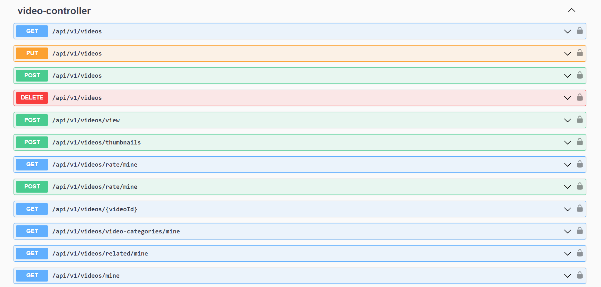
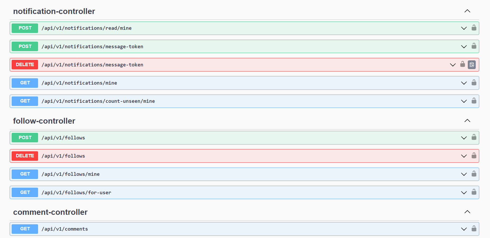
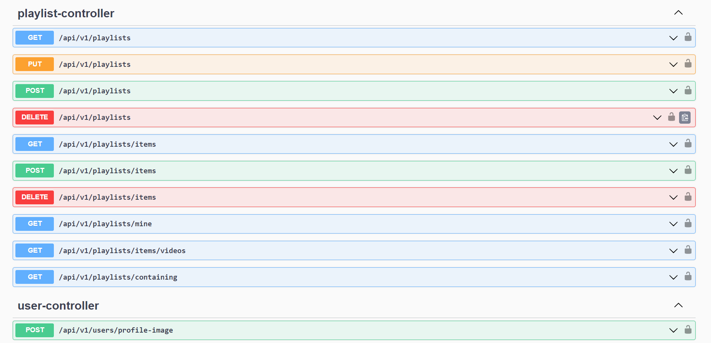
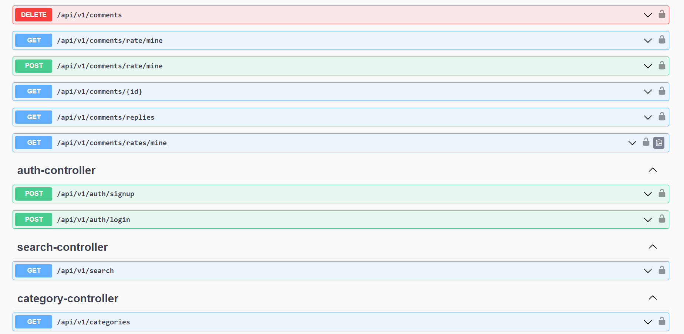

# Video Sharing API

This project is a REST API built on the Spring Boot framework,
designed to provide a backend for a video sharing platform.

_In addition to this backend API, a [Flutter-based frontend application](https://github.com/ntandat64dev/video-sharing-app) has been developed to interact with this API, providing a seamless user experience on mobile devices._

|  |  |
|----------------------------------------------------------|----------------------------------------------------------|
|  |  |

## Key features

- **Authentication and Authorization:** Securing user registration, login, role-based access control.
- **Video management:** Users can upload and manage their videos.
- **Playlist management:** Users can create and manage playlists.
- **Following:** Users can follow other users to stay updated with their uploads.
- **Like and Comment:** Users can like and comment on videos.
- **Searching:** Users can search for videos, users, playlists using keywords.
- **Push notifications:** Real-time notifications for activities like new followers, new video uploads, and comments.

## Technologies used

- Spring Boot, Spring Security, Spring AOP, Spring Data JPA, String Data Elasticsearch.
- MySQL database.
- JWT (JSON Web Token).
- FCM (Firebase Cloud Messaging).
- Docker (for running MySQL, Elasticsearch, and Testcontainers).
- AWS for storage and deployment.
- OpenAPI/Swagger.
- JUnit 5, Testcontainers.